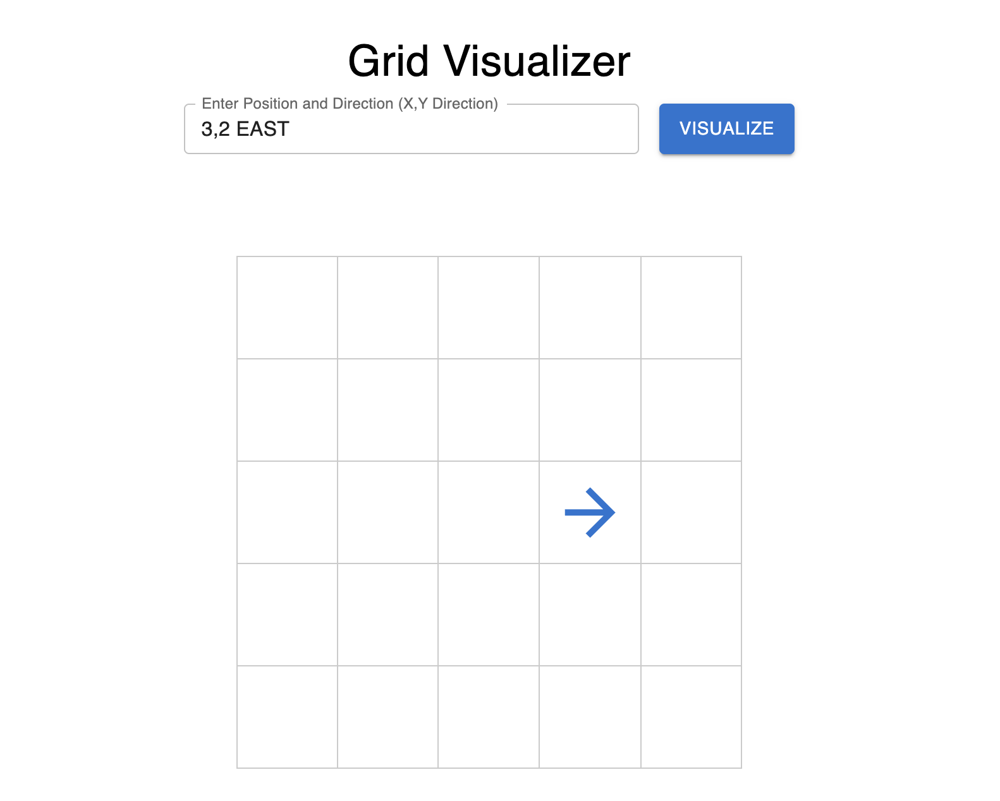
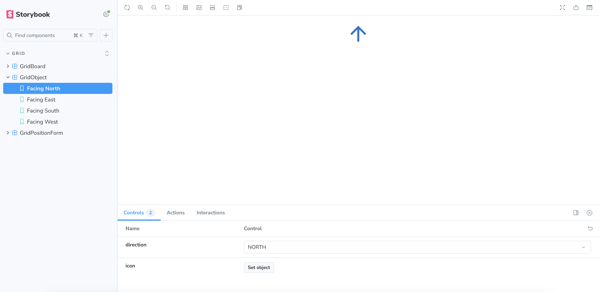

# Grid Visualizer

Grid Visualizer is a React application that visualizes the placement of an object on a 5x5 grid. The position and direction of the object are determined by an input string in the format "x,y direction" (e.g., "1,1 NORTH"). The project uses Material UI for the user interface and Storybook for component documentation and development.



## Available Scripts

In the project directory, you can run:

### `npm start`
Runs the app in development mode. Open [http://localhost:3000](http://localhost:3000) to view it in your browser.

### `npm run storybook`
Starts Storybook to document and develop components in isolation. Open [http://localhost:6006](http://localhost:6006) to view it in your browser.

### `npm test`
Launches the test runner in interactive watch mode.

## Storybook

Storybook is used to document and develop components in isolation. It provides a visual interface to test different states and scenarios of the components.

To start Storybook, run:
```bash
npm run storybook

Grid Board


Grid Object



Grid Position Form


