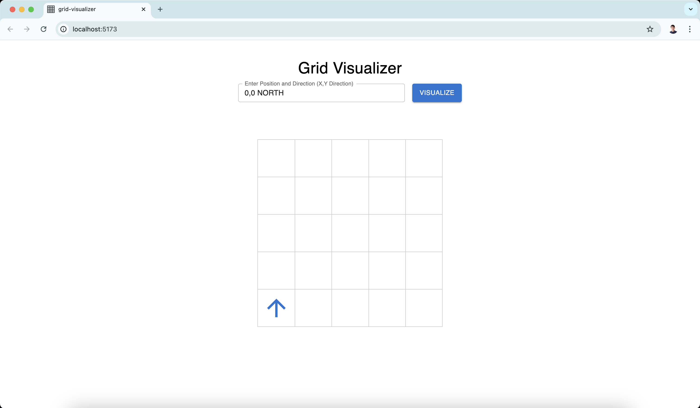

# Grid Visualizer

Grid Visualizer is a React application that visualizes the placement of an object on a 5x5 grid. The position and direction of the object are determined by an input string in the format "x,y direction" (e.g., "1,1 NORTH"). The project uses Material UI for the user interface and Storybook for component documentation and development.

## Available Scripts

In the project directory, you can run:

### `npm run dev`
Runs the app in development mode using Vite. Open [http://localhost:5173](http://localhost:5173) to view it in your browser (default Vite port).

### `npm run build`
Builds the app for production using Vite.

### `npm run preview`
Serves the production build locally for preview.

### `npm run storybook`
Starts Storybook to document and develop components in isolation. Open [http://localhost:6006](http://localhost:6006) to view it in your browser.

### `npm run build-storybook`
Builds Storybook for production.

### `npm run lint`
Runs ESLint to check code quality and style.

### `npm run lint:fix`
Runs ESLint and automatically fixes issues where possible.

### `npm run format`
Formats code using Prettier.

### `npm run format:check`
Checks if code is properly formatted using Prettier.

## Storybook

Storybook is used to document and develop components in isolation. It provides a visual interface to test different states and scenarios of the components.

To start Storybook, run:
### `npm run storybook`

### Grid Board

### Grid Object

### Grid Position Form

